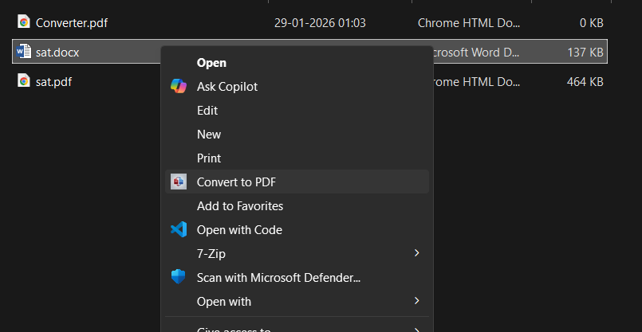

# DocxPdf-Converter
A Python-based Windows utility for converting DOCX files to PDF and PDF files to DOCX, packaged as a standalone executable with an installer for easy distribution.

## Features

- Automated conversion from DOCX to PDF
- Automated conversion from PDF to DOCX
- Backend-focused tool (no GUI) for automation use cases
- Packaged as standalone Windows executable using PyInstaller
- Distributed using a custom Windows installer (Inno Setup)
- Suitable for batch processing and internal tooling

## Tools

- Python
- python-docx / docx2pdf / PDF processing libraries
- PyInstaller (Executable packaging)
- Inno Setup (Windows installer)

## Screenshots

### Docs To pdf
)

### Conversion Output

